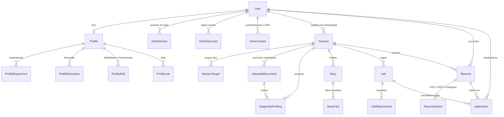

# Banco de dados

Postgres com **Prisma** como ORM e ferramenta de migration. O **Supabase** entra
apenas como Postgres gerenciado, pela connection string — não usamos a CLI do
Supabase, nem `supabase/migrations`, nem Supabase Auth.

- Schema: [`apps/api/prisma/schema.prisma`](../../apps/api/prisma/schema.prisma)
- Migrations: [`apps/api/prisma/migrations/`](../../apps/api/prisma/migrations/)
- Seed: [`apps/api/prisma/seed.ts`](../../apps/api/prisma/seed.ts)
- Cliente no NestJS: [`apps/api/src/prisma/`](../../apps/api/src/prisma/)

---

## Começando

```bash
cp .env.example .env     # os valores padrão já servem para o local
npm run db:up            # Postgres 16 na 5434 + Redis 7, via docker-compose
npm run db:migrate       # aplica as migrations
npm run db:seed          # dado de amostra (idempotente)
npm run dev:api

curl localhost:3001/health/db     # {"database":"ok","latencyMs":1}
```

### Scripts

Todos existem na raiz e repassam para `apps/api`.

| Script                | O que faz                                                      |
| :-------------------- | :------------------------------------------------------------- |
| `npm run db:up`       | Sobe Postgres e Redis (docker-compose)                         |
| `npm run db:down`     | Derruba os containers (`-- -v` remove também os volumes)       |
| `npm run db:migrate`  | `prisma migrate dev` — cria e aplica migration de uma mudança  |
| `npm run db:deploy`   | `prisma migrate deploy` — só aplica pendentes; usado no deploy |
| `npm run db:reset`    | Destrói e recria o banco. **Só em desenvolvimento**            |
| `npm run db:seed`     | Roda o seed                                                    |
| `npm run db:generate` | Regenera o Prisma Client                                       |
| `npm run db:studio`   | Abre o Prisma Studio                                           |

---

## Modelo de dados

22 modelos, em quatro blocos. As entidades não foram inventadas: saem do
`@dataclass Sessao` e do `prompt_extrair_perfil` do protótipo em
[`docs/demo/`](../demo/) e das fases 1–9 da
[metodologia](../business/methodology/metodologia-do-sistema.md).



### Bloco 1 — Identidade e autenticação

`User`, `AuthSession`, `OAuthAccount`, `EmailVerificationToken`,
`PasswordResetToken`, `UserConsent`.

Auth é nossa. Como não usamos Supabase Auth, não existe `auth.users` para
referenciar e todo o ciclo de credencial e token está modelado aqui. A task de
autenticação (endpoints, hashing, JWT) é posterior — o que existe agora é o
schema que ela vai consumir.

Dois cuidados que estão no schema por razão de segurança, não de estilo:

- **`User.passwordHash` é omitido em toda leitura.** O `PrismaService` aplica
  `omit` global, então a coluna não sai por resposta de controller, log ou
  payload de fila. Para conferir a senha no login — o único caso que precisa
  dela — peça explicitamente: `omit: { passwordHash: false }`.
- **Token nunca é guardado em claro.** `AuthSession.refreshTokenHash` e os dois
  modelos de token guardam só o hash: um vazamento dessas tabelas não pode ser
  suficiente para assumir a sessão de ninguém.

`UserConsent` é histórico de linhas com `version`, e não um booleano no `User`,
porque a LGPD exige demonstrar **a que texto** o titular consentiu. Um texto novo
exige consentimento novo.

### Bloco 2 — Perfil profissional

`Profile` (1:1 com `User`), `ProfileExperience`, `ProfileEducation`,
`ProfileSkill`, `ProfileLink`.

As listas são tabelas, e não `jsonb`, porque a UI edita item a item (tela
`confirm-facts` do protótipo) e o motor de redação percorre item a item — com
`jsonb`, toda edição pontual viraria read-modify-write da lista inteira.

Algumas colunas existem porque uma regra da metodologia depende delas:
`isInformal` mantém o vínculo na linha do tempo mas fora do cálculo de meses
formais que sugere o arquétipo; `isPersonalProject` é o que limita a densidade a
1–2 bullets (contra 2–4 de emprego formal) na calibragem anti-inflação;
`ProfileEducation.status = COMPLETED` é o gatilho do orientador proativo de
carreira.

### Bloco 3 — Rodada da metodologia

`Session`, `SessionTarget`, `UploadedDocument`, `DiagnosticFinding`, `Story`,
`StoryFact`, `Job`, `JobRequirement`.

> **`Session` não é sessão de autenticação.** É uma passada pela metodologia, do
> diagnóstico ao currículo pronto. Sessão de login é `AuthSession`. "Sessão" é
> palavra do domínio do produto e da autenticação ao mesmo tempo, e os dois
> modelos carregam docblock dizendo isso.

Três guardrails da metodologia que viraram estrutura:

- **Transcrição, fato e bullet são três coisas separadas.** `Story.transcript`
  (fala bruta) → `StoryFact` (extração, com `isConfirmed`) → `Resume.content`
  (texto redigido). A seção 11 proíbe publicar transcrição crua ou usar fala não
  confirmada, e um `StoryFact` de tipo `NUMBER` só pode virar bullet se a pessoa
  o confirmou — é o guardrail contra número inventado.
- **`Story.audioDeletedAt` existe porque a retenção de áudio é decisão aberta**
  (seção 12). Descartar após a transcrição é o mais seguro em LGPD, e a coluna
  permite apagar o arquivo sem perder o registro de que ele existiu.
- **Não existe coluna de score de aderência, e não deve existir.** `Job` guarda
  `recommendation` em texto, com o motivo. Número daria falsa precisão
  matemática a um julgamento que não a tem.

### Bloco 4 — Currículo e funil

`Resume`, `ResumeExport`, `Application`.

`Resume.kind = JOB_TARGETED` marca a versão dirigida a uma vaga específica, que
pela seção 7 **nunca** vira o currículo padrão. `Resume.archetype` é congelado na
geração: o arquétipo da sessão pode mudar depois, e o currículo já gerado precisa
continuar explicável pela regra que o produziu.

`Application` com `resumeId` e `jobId` nulos é a candidatura de **baseline** — o
que a pessoa já enviava antes de usar o sistema. A seção 10 trata esse registro
como o dado mais valioso que o sistema pode acumular: sem ele não há como dizer
se mudar o currículo mudou alguma coisa.

### Fora de escopo por ora

Pagamento (PIX), assinatura e anúncios **não** estão modelados. O gateway sequer
foi escolhido (§4.1 de [proximos-passos-mvp.md](../business/proximos-passos-mvp.md)),
e modelar cobrança antes disso seria especulação.

---

## Row Level Security

**Postura: RLS habilitada em todas as tabelas, sem nenhuma policy.** RLS ativa
sem policy nega tudo.

### Por que, se a autorização é feita na API

RLS aqui **não** é o mecanismo de autorização — esse fica na camada NestJS, e é
lá que a regra de "cada um só vê o que é seu" é escrita e testada. O Prisma
conecta com o papel dono do schema, que faz bypass de RLS de qualquer forma.

O motivo é outro, e é concreto: **o Supabase publica automaticamente todas as
tabelas do schema `public` pela Data API (PostgREST)**, acessível com a chave
anônima do projeto. Uma tabela criada pelo Prisma sem RLS fica legível por
qualquer um que tenha essa chave — e `Profile`, `Story` e `Resume` são recheados
de dado pessoal, com possível dado sensível.

Duas camadas, na migration
[`20260902041400_enable_rls_deny_by_default`](../../apps/api/prisma/migrations/20260902041400_enable_rls_deny_by_default/migration.sql):

1. `ENABLE ROW LEVEL SECURITY` em cada tabela, sem policy → nega tudo.
2. `REVOKE` dos grants de `anon` e `authenticated`, mais `ALTER DEFAULT
PRIVILEGES` para que tabela criada por migration futura não volte a nascer
   aberta. Envolvido em `DO/IF` porque esses papéis são do Supabase e não existem
   no Postgres local.

Não usamos `FORCE ROW LEVEL SECURITY`: ele faria a RLS valer também para o dono
da tabela, que é o papel com que o Prisma conecta — a aplicação perderia acesso
ao próprio banco.

### O que isso implica

- Acesso ao dado passa **obrigatoriamente** pela API NestJS.
- Se algum dia quisermos leitura direta do cliente, o caminho é adicionar
  policies explícitas por tabela — nunca desabilitar RLS.
- **Tabela nova sem `ENABLE` na migration nasce exposta.** É por isso que existe
  [`schema-rls.spec.ts`](../../apps/api/src/prisma/schema-rls.spec.ts): ele lê o
  schema e as migrations do disco e falha o `npm test` quando um modelo fica sem
  RLS, sem `CREATE POLICY` ter sido adicionado às cegas, e sem `FORCE`. Roda sem
  banco.

Conferindo à mão:

```bash
# toda tabela deve ter relrowsecurity = t
docker exec hirepair-postgres psql -U hirepair -d hirepair -c \
  "select relname, relrowsecurity from pg_class
   where relnamespace='public'::regnamespace and relkind='r' order by 1;"

# deve ser 0
docker exec hirepair-postgres psql -U hirepair -d hirepair -c \
  "select count(*) from pg_policies where schemaname='public';"
```

---

## Fluxo de migration

**Sempre gere com o Prisma**, nunca escreva a migration à mão como fluxo
principal:

```bash
# 1. edite apps/api/prisma/schema.prisma
# 2. gere e aplique
npm run db:migrate
```

Depois de mudar o schema, mantenha coerentes: `schema.prisma`,
`prisma/migrations/*` e o código que consome o Prisma Client.

### As duas exceções, e como tratá-las

SQL que o DSL do Prisma não expressa — RLS, grants, trigger, função, índice
parcial. Nesses casos:

1. `npx prisma migrate dev --create-only --name <descricao>` gera a pasta sem
   aplicar;
2. anexe o SQL manual **abaixo** do diff gerado, com comentário explicando o
   motivo;
3. `npm run db:migrate` aplica.

**Nunca edite uma migration já aplicada.** O checksum muda e o Prisma passa a
acusar migration modificada em todo comando. Se precisar corrigir, crie uma nova
migration — ou, em desenvolvimento e sabendo que vai perder os dados,
`npm run db:reset`.

### O que o CI verifica

O [workflow de PR](../../.github/workflows/ci-pr.yml) sobe um Postgres
descartável (nunca o Supabase) e roda três coisas depois do gate de qualidade:

- `db:deploy` — as migrations aplicam num banco **vazio**, na ordem. É o mesmo
  comando do deploy: se falhar aqui, o app não sobe em produção.
- **drift check** — `prisma migrate diff --from-config-datasource --to-schema`
  compara o banco recém-migrado com o `schema.prisma`. Qualquer diferença
  significa schema editado sem migration gerada.
- `db:seed` **duas vezes** — a segunda prova a idempotência dos `upsert`.

---

## Deploy e Supabase

### Migrations aplicam no boot

`apps/api/package.json` declara:

```json
"prestart:prod": "prisma migrate deploy",
"start:prod": "node dist/main"
```

O npm roda `prestart:prod` automaticamente antes de `start:prod`, então qualquer
ambiente que suba a API por `npm run start:prod` aplica as migrations pendentes
primeiro. Sem `DATABASE_URL` no ambiente o comando falha alto, e isso é o
correto: melhor não subir do que subir contra um schema desatualizado.

É o mesmo padrão do `docker/docker-entrypoint.sh` do repositório de referência
(`amora_corban_api`). Quando este repo ganhar um Dockerfile, o `ENTRYPOINT` só
precisa chamar `npm run start:prod` e herda o comportamento.

### As duas URLs

Em _Supabase → Project Settings → Database → Connection string_:

| Variável       | Qual copiar                       | Usada por        |
| :------------- | :-------------------------------- | :--------------- |
| `DATABASE_URL` | Transaction pooler (porta `6543`) | A API em runtime |
| `DIRECT_URL`   | Session pooler (porta `5432`)     | `prisma migrate` |

A separação existe por exigência do Supabase: o pooler em modo transaction é o
certo para a aplicação (conexão direta de função serverless esgota o Postgres),
mas não sustenta a sessão longa nem o advisory lock que a migration usa.
`prisma.config.ts` resolve `DIRECT_URL ?? DATABASE_URL`, então localmente basta
deixar `DIRECT_URL` em branco.

Usamos `@prisma/adapter-pg` (node-postgres), que não usa prepared statements
nomeados por padrão — logo o modo transaction do Supavisor é seguro sem
`pgbouncer=true` na URL.

O pool é configurado em código (`PrismaPg({ max })`), não por parâmetro na URL:
padrão 10 conexões, ajustável por `PRISMA_CONNECTION_LIMIT`.

### Depois do primeiro deploy

Confirme no SQL Editor do Supabase que a Data API está fechada:

```sql
select has_table_privilege('anon', 'public."User"', 'SELECT'); -- false
select count(*) from pg_policies where schemaname = 'public';  -- 0
```

---

## Convenções do schema

Herdadas de `amora_corban_api`:

- Modelos **PascalCase singular**, campos **camelCase**, **sem `@@map`/`@map`** —
  o Postgres guarda os identificadores entre aspas, com o mesmo nome do Prisma
  (`"Profile"."fullName"`).
- Id sempre `String @id @default(uuid())`.
- `createdAt DateTime @default(now())` e `updatedAt DateTime @updatedAt` no
  rodapé do modelo, depois `@@unique`, depois `@@index`.
- Soft delete é `deletedAt DateTime?`, filtrado **explicitamente** na consulta —
  sem middleware que esconda linhas por trás das costas de quem lê o código.
- Comentários `///` carregam o **porquê** da coluna, não o que ela obviamente é.
- `datasource db` **não tem `url`**: ela vem do `prisma.config.ts`, para que CLI
  e aplicação leiam a mesma variável de ambiente.

O Prisma Client é gerado no `postinstall` de `apps/api`, então `npm ci` já o
deixa disponível — é o que permite `typecheck`, `test` e `build` sem banco.

## Seed

Dado de **amostra**, não de configuração: um usuário de desenvolvimento
(`dev@hirepair.local`) com perfil do arquétipo C — a persona primária do MVP — e
uma rodada completa da metodologia, com relato, fatos, vaga classificada,
currículo e uma candidatura de baseline.

Todo write é `upsert` com **`update: {}`**, então reexecutar nunca duplica nem
sobrescreve edição feita à mão no banco local. Ids fixos onde não há chave
natural, porque é o id que torna o upsert idempotente. Há guarda contra
`NODE_ENV=production`.

Quando existir dado de configuração que precise ir a produção, ele entra num
`seed.production.ts` separado — não no seed de desenvolvimento.
